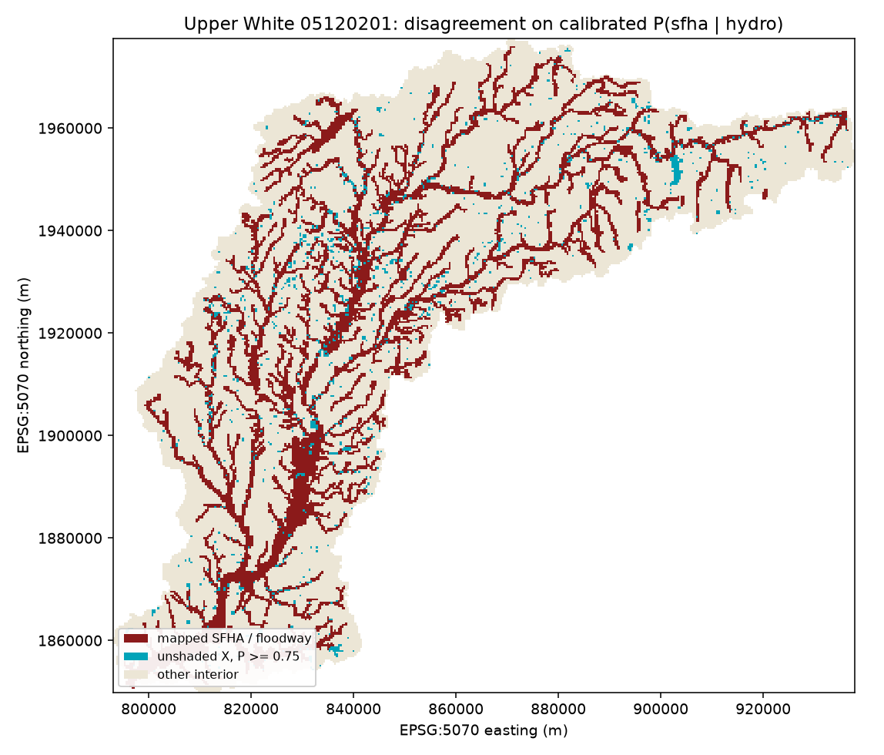
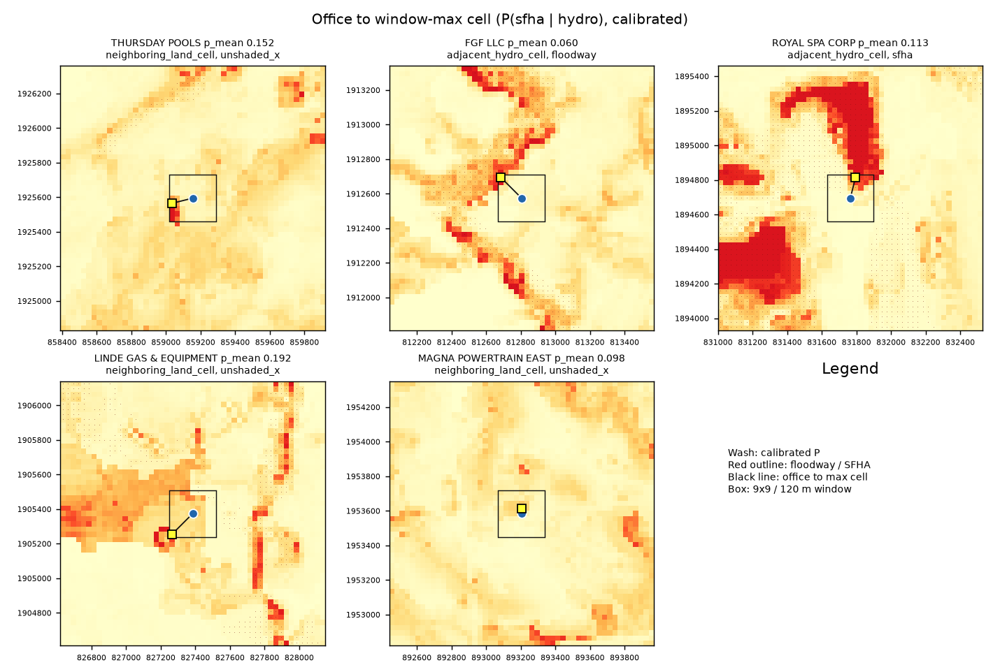
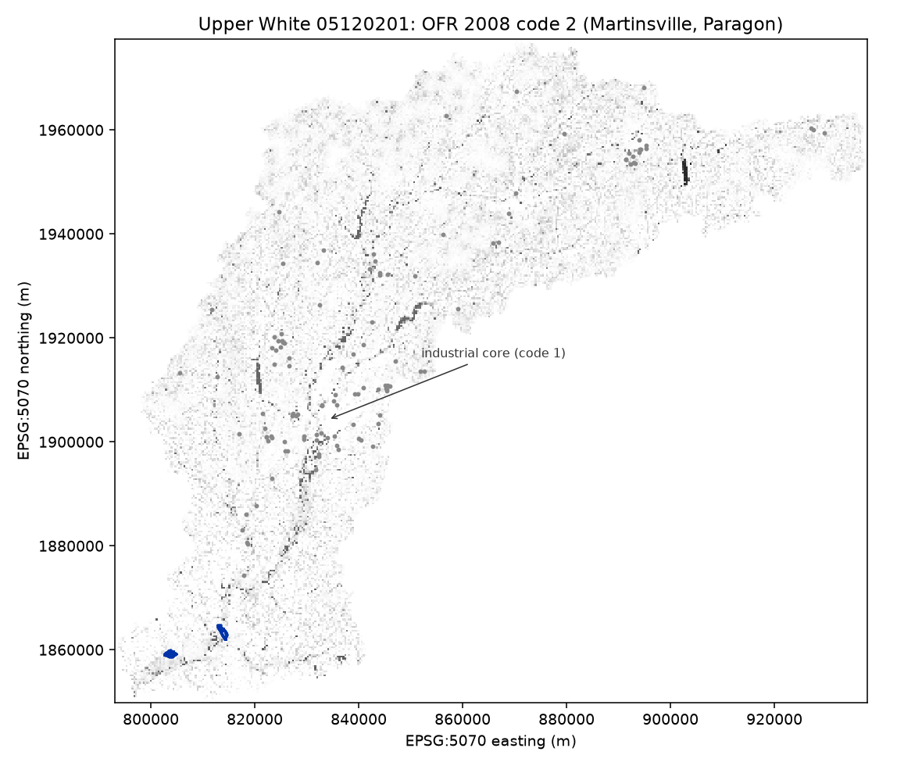
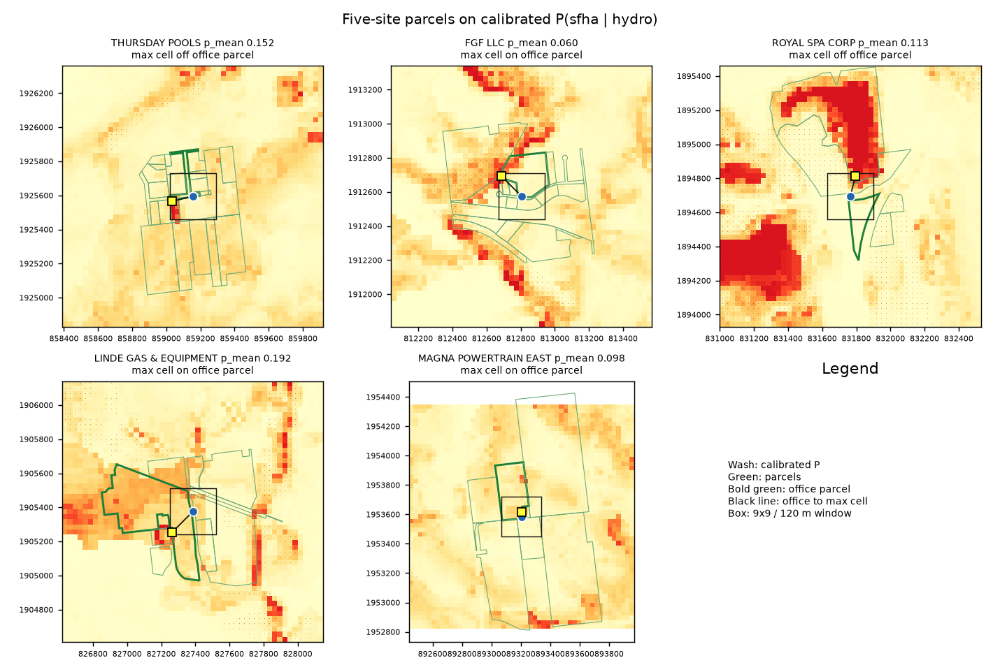

# Upper White flood-map completion

This tree scores every 30 meter cell in the Upper White River basin (HUC-8 **05120201**) for how much it looks like FEMA's current Special Flood Hazard Area, given terrain and distance-to-water. The score is `P(sfha | hydro)`. TRI on-site releases for 2023 are an overlay, not the training target.

`P(sfha | hydro)` is a map-completion score, not a 100-year exceedance.

Calibrated OOF PR-AUC (0.36) beats the SFHA-rate baseline (0.10) and a HAND score (0.24). To three decimals: raw PR-AUC 0.369, calibrated 0.362, Brier 0.073 after isotonic calibration. Stage D samples `p_sfha_calibrated.tif` only.

Five Zone X plants have one wet cell in a 120 m window; site-mean P is 0.06 to 0.19; none clear 0.50 on the footprint.

THURSDAY POOLS is the only large-inventory terrain hit, and it is neighboring land.

June 2008 Appendix 2 does not cover the industrial core of 05120201.

| Plant | 2023 on-site release (lb) | Highest P in 120 m | Mean P (p_mean) | What the high cell is |
|---|---:|---:|---:|---|
| THURSDAY POOLS | 257,590 | 0.769 | 0.152 | max off parcel, neighboring unshaded X, HAND = 0 |
| FGF LLC | 27,335 | 0.780 | 0.060 | on-parcel floodway sliver; dry mean |
| ROYAL SPA CORP | 4,950 | 0.774 | 0.113 | waterbody cell off the office parcel |
| LINDE GAS & EQUIPMENT | 1,048 | 0.763 | 0.192 | max on the office parcel |
| MAGNA POWERTRAIN EAST | 0 | 0.789 | 0.098 | max on the office parcel |

The table ranks on window-max P. Buffer-max is one 30 m cell; buffer-mean is the 120 m footprint. THURSDAY POOLS (p_mean 0.152): max off parcel, neighboring unshaded X, HAND = 0. FGF LLC (p_mean 0.060): floodway cell on the office parcel, so the lot is still not a wet footprint. ROYAL SPA CORP (p_mean 0.113): waterbody cell off the office parcel. LINDE GAS & EQUIPMENT (p_mean 0.192) and MAGNA POWERTRAIN EAST (p_mean 0.098): max on the office parcel; means stay below 0.50.



Figure 1. Basin disagreement on calibrated `P(sfha | hydro)`. Dark red: mapped SFHA and floodway. Cyan: unshaded X with calibrated P >= 0.75 (same t as Table 1 window-max, pixel not plant). Pale: other interior. Cyan is map-completion on the FIRM, not a plant-level hazard list.



Figure 2. Office point to window-max cell. Each panel title has p_mean. Wash is calibrated P. Box is the 9x9 (120 m) window. THURSDAY POOLS p_mean 0.152 is neighboring unshaded X, max off parcel. FGF LLC p_mean 0.060 is an on-parcel floodway sliver. ROYAL SPA CORP p_mean 0.113 is a waterbody cell off the office parcel. LINDE GAS & EQUIPMENT p_mean 0.192 and MAGNA POWERTRAIN EAST p_mean 0.098 have the max cell on the office parcel.



Figure 3. June 7-9, 2008 inundation (OFR 2008-1322) code 2 on the same HUC. Blue polygons: Martinsville and Paragon. Grey dots: 117 TRI office points. D2 stays 117 / 0. Appendix 2 is reach-scale; the industrial core is code 1.



Figure 4. Indiana 2025 parcels (GIS Data Harvest) on the five Table 1 sites only. Snap 30 m. D tables unchanged. THURSDAY POOLS p_mean 0.152: max cell off the office parcel. FGF LLC p_mean 0.060: floodway cell on the office parcel. ROYAL SPA CORP p_mean 0.113: waterbody cell off the office parcel. LINDE GAS & EQUIPMENT p_mean 0.192 and MAGNA POWERTRAIN EAST p_mean 0.098: max cell on the office parcel. Folder: `logs/parcels/`.

Map (interactive): [logs/stage_d/map.html](logs/stage_d/map.html). Interview note: [docs/interview_note.pdf](docs/interview_note.pdf).

101 of 117 in-HUC plants sit on mapped unshaded X. The other 16 are already floodway (2), SFHA (4), shaded X (8), or unmapped (2).

Limitations:

- Parcels: five Table 1 sites only (Indiana 2025 harvest, `logs/parcels/`). Rest of the HUC has no cadastral clip.
- No soil: hydrologic soil group is not in this model.
- Not a FIRM: P does not replace the effective flood map.
- 2008 is coverage: 117 plants in mask code 1, 0 in code 2. Appendix 2 reaches in the HUC are Martinsville and Paragon only.

Sibling occupancy study: `indiana_hazmat_floodplain` (parked, Stage 0 frozen 2026-08-25). This tree imports that occupancy as a freeze file. It does not recompute it.

| File | Role |
|------|------|
| [METHODOLOGY.md](METHODOLOGY.md) | Locked contract |
| [AGENTS.md](AGENTS.md) | Agent rules |
| [CHECKLIST.md](CHECKLIST.md) | Operator list |
| `src/floodmap/` | Claims, freeze, HUC, template, Stage 0 |
| `whiteforge/` | GraphForge pin |

## Stage 0

```bash
python3.12 -m venv .venv
source .venv/bin/activate
pip install -r requirements.txt
PYTHONPATH=src:. python3 scripts/run_stage0.py \
  --huc tests/fixtures/huc.geojson \
  --out logs/stage0_fixture
PYTHONPATH=src:. python3 -m pytest tests -q
```

Hard gate: freeze numbers match, claim scan clean, HUC non-empty, template EPSG:5070 at 30 m, product laws allow Stage 0. See METHODOLOGY.md.

Live WBD + NLCD 2021 (network; writes `data/raw/` and `data/interim/`, gitignored):

```bash
PYTHONPATH=src:. python3 scripts/run_stage0_live.py
```

Stage A (network; live `nlcd_2021` template required):

```bash
PYTHONPATH=src:. python3 scripts/run_stage_a.py
```

Stage B (network for NHD waterbodies; live template + DEM required):

```bash
PYTHONPATH=src:. python3 scripts/run_stage_b.py
```

Finite TWI on interior, toy-watershed tests in `tests/test_hydro.py`, bands on transform sha256 `479ac37628bfd7e5`. D1 is `unshaded_x`. OFR 2008-1322 Appendix 2 is a reach-scale three-state mask. HSG stays out of the B stack and out of this C model.

Stage C (HUC-10 fetch; live bands required):

```bash
PYTHONPATH=src:. python3 scripts/run_stage_c.py
```

Report and colorbar: `P(sfha | hydro)`. Calibrate OOF scores before D:

```bash
PYTHONPATH=src:. python3 scripts/run_c_calibrate.py
PYTHONPATH=src:. python3 scripts/run_stage_d.py
PYTHONPATH=src:. python3 scripts/run_d_map.py
PYTHONPATH=src:. python3 scripts/run_d_shap.py
PYTHONPATH=src:. python3 scripts/run_d_cartography.py
PYTHONPATH=src:. python3 scripts/run_parcels.py
```

The fixture path is the CI join. gSSURGO C2 is not run. Do not reopen D, B, or raw `p_sfha.tif`.

## Claim bans

Reports state hydrologic class and, later, TRI overlay tables. The scanner in `floodmap.claims` fails the run if the report text includes casualty language, climate attribution, tornado counts, population-at-risk, TRI storage as pounds, `P` as a 100-year exceedance, or the phrase “unmapped risk”.

## GraphForge

Pin: `whiteforge/`. Verify-before-done is the finish gate.

## Legal

Copyright (c) 2026 Martial Systems LLC. All rights reserved.
